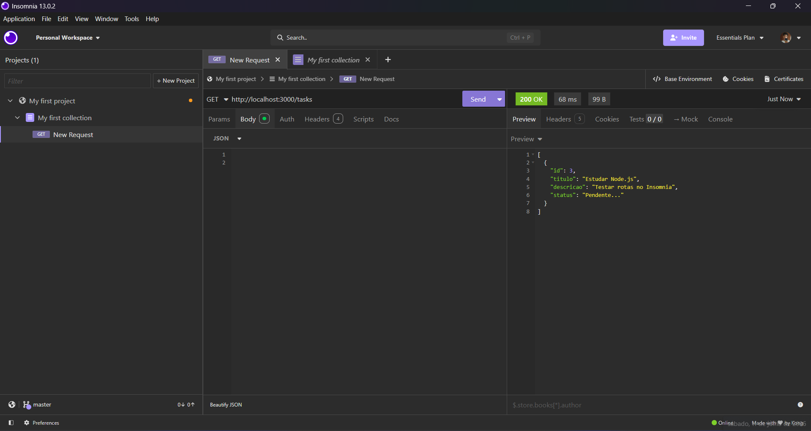

# 🚀 Tasks CRUD API - Node.js & Express



## 📌 Sobre o projeto
API REST para gerenciamento de tarefas (CRUD), evoluída de Node.js puro para o ecossistema robusto do **Express**. Esta aplicação possui arquitetura **Multi-tenant** (onde cada usuário gerencia apenas as próprias tarefas), autenticação segura, testes E2E e está hospedada na nuvem.

## ⚙️ Funcionalidades
- **Autenticação:** Cadastro e Login com Senhas Criptografadas (Bcrypt) e emissão de Crachás Virtuais (JWT).
- **Multi-tenant:** Isolamento completo de dados por usuário.
- **Paginação e Busca:** Listagem de tarefas otimizada com `limit`, `page` e `search`.
- **CRUD Completo:** Criação, Edição, Atualização de Status e Remoção de tarefas.
- **Testes Automatizados:** Cobertura de testes End-to-End (E2E) com Jest e Supertest.
- **Documentação Interativa:** Portal do desenvolvedor gerado com Swagger (OpenAPI) na rota `/api-docs`.

## 💻 Tecnologias
- **Node.js & Express** (Servidor Web e Roteamento)
- **PostgreSQL / Supabase** (Banco de Dados Relacional em Nuvem)
- **pg & pg-pool** (Driver e Gerenciamento de Conexões)
- **JSON Web Token (JWT)** (Autenticação Stateless)
- **Bcryptjs** (Criptografia de Senhas)
- **Jest & Supertest** (Testes Automatizados E2E)
- **Swagger / OpenAPI** (Documentação Interativa da API)
- **Render** (Hospedagem / Deploy Contínuo)
- **Dotenv** (Gerenciamento de Variáveis de Ambiente)

## 🚀 Como executar localmente
1. Clone este repositório:
   ```bash
   git clone https://github.com/felipe-rodriguesz/CRUD_de_Tarefas_Express.git
   ```
2. Instale as dependências:
   ```bash
   npm install
   ```
3. Crie um arquivo `.env` na raiz do projeto e configure a variável `DATABASE_URL` com a sua string de conexão do Supabase/Postgres.
4. Inicie o servidor:
   ```bash
   npm start
   ```
5. A API estará escutando na porta `http://localhost:3000`.
6. Acesse a documentação oficial da API no seu navegador: `http://localhost:3000/api-docs`

## 🛣️ Rotas da API

### Usuários
| Método | Rota | Descrição |
|---|---|---|
| `POST` | `/usuarios/cadastro` | Cria um novo usuário |
| `POST` | `/usuarios/login` | Autentica e retorna o Token JWT |

### Tarefas (Necessário Header: `Authorization: Bearer <token>`)
| Método | Rota | Descrição |
|---|---|---|
| `POST` | `/tasks` | Cria uma nova tarefa vinculada ao usuário logado |
| `GET`  | `/tasks` | Lista tarefas (Aceita Query Params: `?search=`, `?page=`, `?limit=`) |
| `PUT`  | `/tasks/:id` | Atualiza o título e/ou descrição de uma tarefa sua |
| `PATCH`| `/tasks/:id/complete` | Altera o status da tarefa para concluída |
| `DELETE`|`/tasks/:id` | Exclui a tarefa do banco de dados |

## 🧠 O que aprendi
Neste projeto, a aplicação evoluiu de um script simples para uma arquitetura Backend de mercado. Os principais aprendizados foram:
- **Padrão MVC e Clean Architecture:** Separação estrita entre Rotas (Controllers) e Funções de Banco de Dados.
- **Segurança:** Implementação de Middlewares no Express para validar Tokens JWT, proteger rotas privadas e isolar dados (Multi-tenant) injetando o `usuario_id` nas consultas SQL.
- **Bancos de Dados Relacionais:** Transição de SQLite local para PostgreSQL na nuvem utilizando Supabase, Connection Pooling (IPv4) e o driver nativo `pg`.
- **Garantia de Qualidade (QA):** Criação de bancos de dados isolados para ambiente de testes (`TEST_DATABASE_URL`) e elaboração de testes E2E com Jest para testar possíveis brechas de segurança.
- **Documentação Interativa:** Uso do `swagger-ui-express` e anotações JSDoc para gerar dinamicamente o catálogo da API (OpenAPI), permitindo testes direto no navegador.
- **Deploy:** Hospedagem da aplicação publicamente através do Render, gerenciando variáveis de ambiente seguras (`.env`).

## 🚀 Melhorias futuras (Ideias)
- Adicionar validação de dados mais rigorosa com bibliotecas como Zod ou Joi.
- Implementar fluxo de recuperação de senha por e-mail.
- Adicionar níveis de acesso (ex: Usuário Comum e Administrador).
